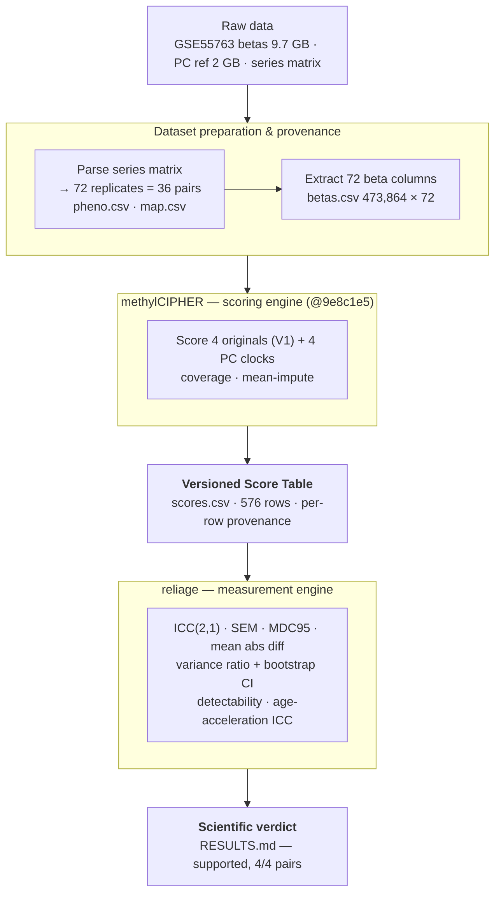

# PIPELINE — GSE55763 technical-reliability run

How the first real reliage result was produced, end to end. This document serves
two purposes: the prose explains **what was computed**; the diagram makes the
**execution chain** immediately understandable.

---

## 1 · Purpose and scope

reliage v1 answers one question on real, independently rebuilt public replicate
data: **do PC-transformed epigenetic clocks reduce technical measurement error
versus their originals?** This pipeline took the GSE55763 (Lehne 2015) 36-pair
technical-replicate cohort from raw GEO files to a recorded scientific verdict.

The central architectural statement:

> **methylCIPHER** transforms methylation measurements into biomarker scores.
> **reliage** transforms those scores and their replicate design into
> measurement-capability estimates and a scientific verdict.

Those are two separate engines joined by one interface — the **Versioned Score
Table**. reliage never touches methylation betas or clock formulas; methylCIPHER
never computes reliability. Either engine can be swapped (e.g. pyaging as a second
scorer) without changing the other.

---

## 2 · Pipeline diagram

High-level chain:

```
Raw data
   ↓
Dataset preparation and provenance
   ↓
methylCIPHER scoring engine
   ↓
Versioned Score Table
   ↓
reliage measurement engine
   ↓
Scientific verdict
```

Detailed flow (engine boundary shown explicitly):



The Versioned Score Table is the seam: everything above it is **measurement +
scoring**; everything below it is **measurement science**.

---

## 3 · Step-by-step execution

**Step 0 — Acquire.** Raw betas `GSE55763_normalized_betas.txt.gz` (9.7 GB, NCBI
GEO), PC reference `PCClocks_data.qs2` (2 GB, Zenodo DOI 10.5281/zenodo.19455622),
and the series matrix (50 KB). Verified: md5 `64654afe…`, backup retained.

**Step 1 — Reconstruct the replicate design.** From the series matrix
`Sample_description` fields, identified the **72 technical-replicate samples =
36 individuals × 2 batches** and extracted age + sex. *Computed:* pairing audit —
every subject has exactly 2 measurements (0 malformed).
→ `metadata/pheno.csv`, `metadata/map.csv`, `metadata/replicate_sample_ids.txt`

**Step 2 — Extract the cohort.** Streamed the 30 GB (uncompressed) matrix and kept
only the 72 replicate **beta** columns (skipping the paired `Detection Pval`
columns). *Asserted:* gzip integrity, exactly 72 matched columns, 73 output
columns, ≥400 k rows.
→ `processed/betas.csv` (473,864 CpGs × 72 samples, 596 MB)

**Step 3 — Score (methylCIPHER engine).** With pinned methylCIPHER `@9e8c1e5`:
computed **8 scores per sample** — 4 originals (`calcHorvath1`, `calcHannum`,
`calcPhenoAge`, `calcGrimAgeV1`) + 4 PC (`calcPCClocks`), mean imputation; dropped
4 all-NA CpGs. Also computed per-clock **CpG coverage**.
→ `processed/scores.csv` (576 rows, long-form, per-row provenance) · `scores_wide.csv`

**Step 4 — Reliability analysis (reliage engine).** Over the 36 pairs, computed:
ICC(2,1) + Koo–Li CI + band per clock; within-subject SD, SEM, MDC95, mean abs
diff; **variance ratio (PC/original) + paired bootstrap CI** (primary endpoint);
detectability screen at effects 1/2/5; joint verdict.
→ `out/leaderboard.csv`, `out/contrasts.csv`, `out/results.json`, `out/RESULTS.md`

**Step 5 — Age-acceleration ICC (companion).** Residualized each score on
chronological age, recomputed ICC + variance ratio. *Confirmed:* SEM and variance
ratio invariant (both replicates share one age); ICC drops once age variance is
removed.
→ `out/leaderboard_ageaccel.csv`

**Step 6 — Record.** Provenance and canonical state.
→ `metadata/PROVENANCE.md`, `docs/tracker.md`, `docs/PIR03-C2/status_report_0.3.1.md`

> Steps 3 and 4 are the two computational **engines**; the surrounding stages
> establish the **data identity, experimental design, validation, and provenance**
> required to interpret their outputs. Metadata reconstruction, pairing validation,
> cohort extraction, and provenance are what determine whether the scientific
> result is *valid* — not incidental plumbing.

---

## 4 · Artifact inventory

| Stage | Artifact | Contents |
|---|---|---|
| Acquire | `…/Datasets/GSE55763/raw/GSE55763_normalized_betas.txt.gz` | raw 2,711-sample matrix (backup, md5-verified) |
| Prep | `metadata/pheno.csv` | 72 samples: sample_id, age, sex, batch, subject |
| Prep | `metadata/map.csv` | subject → sample_id (36 pairs) |
| Prep | `metadata/replicate_sample_ids.txt` | the 72 IDs extracted from the matrix |
| Prep | `processed/betas.csv` | 473,864 CpGs × 72 replicate samples |
| **Score** | **`processed/scores.csv`** | **Versioned Score Table — 576 rows, 8 clocks/sample, per-row provenance** |
| Score | `processed/scores_wide.csv` | convenience wide view (72 × 8) |
| Analysis | `out/leaderboard.csv` | ICC / SEM / MDC95 / band per clock |
| Analysis | `out/contrasts.csv` | variance ratio + bootstrap CI (primary endpoint) |
| Analysis | `out/results.json`, `out/RESULTS.md` | machine + human verdict |
| Analysis | `out/leaderboard_ageaccel.csv` | age-acceleration ICCs |
| Record | `metadata/PROVENANCE.md` | commit, versions, coverage, md5, imputation |

---

## 5 · Engine boundary

```
  methylation betas ──▶ [ methylCIPHER ] ──▶ Versioned Score Table ──▶ [ reliage ] ──▶ verdict
       (biology)          scoring engine        (the interface)        measurement        (science)
                                                                          engine
```

- **methylCIPHER** owns clock identity, coefficients, imputation, coverage — the
  transform *betas → scores*. Swappable (pyaging is the planned second producer).
- **reliage** owns ICC, error bands, variance ratios, detectability — the transform
  *scores + replicate design → measurement capability*. Scorer-agnostic: it consumes
  only the score table + replicate map.
- **The Versioned Score Table is the contract.** Any scorer that emits it can be
  measured; any measurement tool that reads it can consume any scorer. (Its long-term
  spec is deferred — see `VST_DESIGN_NOTES.md`.)

---

## 6 · Validation checks

| Check | Result |
|---|---|
| Metadata reproducible | `parse_metadata.py` (in `tools/`) is deterministic — re-runs yield byte-identical `pheno.csv`/`map.csv` (reference copy retained at tag `v0.3.1-scientific-baseline`) |
| Pairing audit | 36 subjects, every one with exactly 2 measurements (0 malformed) |
| Download integrity | `gzip -t` OK · md5 `64654afe…` matches |
| Extraction asserts | exactly 72 beta columns matched · 73 output cols · 473,864 rows |
| CpG coverage (gate) | Horvath1/Hannum/PhenoAge/PC = 100% · GrimAge = 91% (97 imputed) |
| NA handling | 4 all-NA CpGs dropped (recorded) |
| reliage self-check | 4 gates pass: ICC vs Shrout–Fleiss, end-to-end ICC recovery, variance-ratio recovery, detectability bands |
| Age-accel invariance | SEM and variance ratio identical raw vs age-accel (as predicted) |

---

## 7 · Reproduction command

Environment: R 4.6.1 + Rtools45, methylCIPHER `@9e8c1e5` (+ `qs2`/`stringfish`
built from source), Python with numpy/pandas/scipy. Sources:
`ftp.ncbi.nlm.nih.gov/geo/series/GSE55nnn/GSE55763/suppl/` (betas + series matrix)
and Zenodo `10.5281/zenodo.19455622` (PC reference).

> The 9.7 GB `GSE55763_normalized_betas.txt.gz` is a **build-time input**; its path is a
> command-line argument (not hardcoded), so it can live anywhere. It, the series matrix,
> and the PC reference are all needed to regenerate the pipeline, because **nothing under
> `generated/` is committed** — a clone rebuilds metadata, `betas.csv`, the score table,
> and results from the external source. Generator code lives in tracked `tools/`.

```bash
# 1. replicate design from the series matrix
python tools/GSE55763/parse_metadata.py \
       $LONGEVITY_DATA_ROOT/GSE55763/raw/GSE55763_series_matrix.txt.gz  generated/GSE55763/metadata

# 2. extract the 72 replicate beta columns from the 9.7 GB matrix
bash tools/GSE55763/extract_betas.sh \
       generated/GSE55763/metadata/replicate_sample_ids.txt \
       $LONGEVITY_DATA_ROOT/GSE55763/raw/GSE55763_normalized_betas.txt.gz \
       generated/GSE55763/processed/betas.csv

# 3. score (methylCIPHER engine) — pin the commit inside the R script first
Rscript reliage/scoring/score_methylCIPHER.R \
       generated/GSE55763/processed/betas.csv \
       generated/GSE55763/metadata/pheno.csv \
       generated/GSE55763/processed/scores.csv \
       /path/to/PCClocks_data.qs2

# 4. reliability analysis (reliage engine) -> RESULTS.md
python -m reliage.scoring.run_analysis \
       generated/GSE55763/processed/scores.csv \
       generated/GSE55763/metadata/map.csv \
       --out generated/GSE55763/out

# 5. age-acceleration ICC (companion)
python -m reliage.scoring.age_accel_icc \
       generated/GSE55763/processed/scores.csv \
       generated/GSE55763/metadata/map.csv \
       generated/GSE55763/metadata/pheno.csv
```

---

## 8 · Known limitations

- **n = 36 pairs** → wide-ish ICC confidence intervals by design; always read ICC
  *with* its CI and the absolute-error columns (SEM/MDC95), never a bare point.
- **Cross-batch by design** — the two measurements were deliberately processed in
  separate batches, so this estimates reliability under *that* specific stress.
- **GrimAge 91% coverage** (97 imputed CpGs) — the lowest of the five; flag when
  interpreting GrimAge/PCGrimAge.
- **Single dataset, single scorer.** Raw-age and age-acceleration ICC are done;
  **ICC(1,1)/(3,1) sensitivity, formal Tier-3 reproduction tolerance check, and the
  pyaging (second-scorer) sensitivity pass are pending.**
- The **variance-ratio primary endpoint** is invariant to raw-vs-age-accel and to
  ICC form; the **ICC value** is spread-dependent and is not, by itself, the result.

---

## Status

This pipeline has produced more than software readiness. Because `scores.csv`, the
reliability outputs, and `RESULTS.md` now exist, the project has crossed:

- **Gate 2 — Versioned Score Table produced**
- **Gate 3 — Scientific claim evaluated** (verdict: PC reduces technical error, 4/4 pairs)

The next review should therefore focus on **the results themselves** — effect sizes,
uncertainty, reference comparison, and whether the verdict is genuinely supported —
not on execution readiness.
