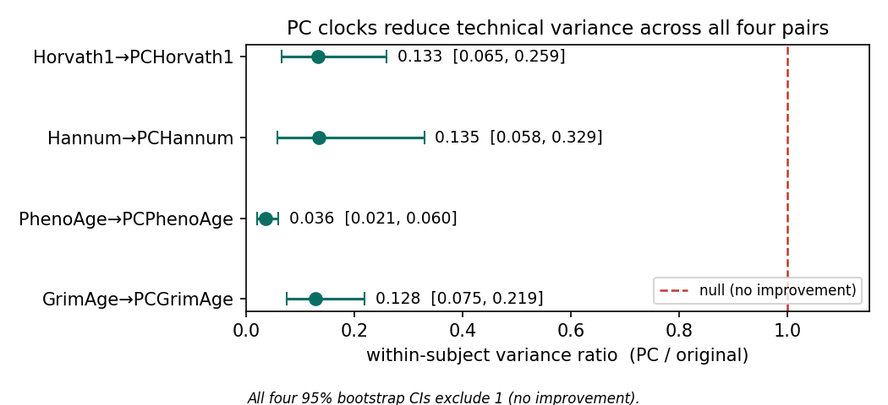
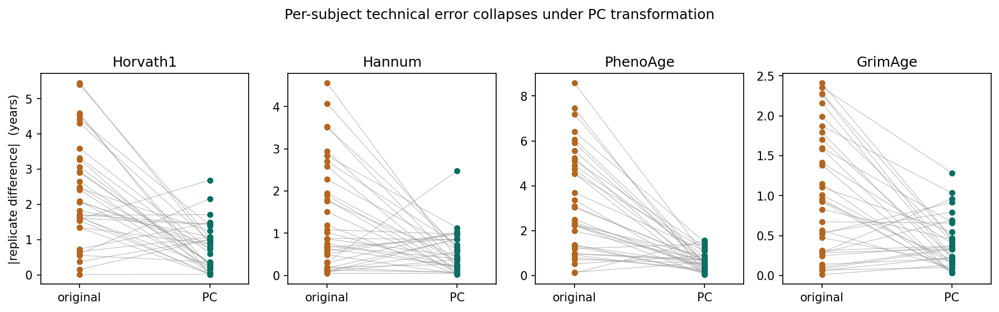
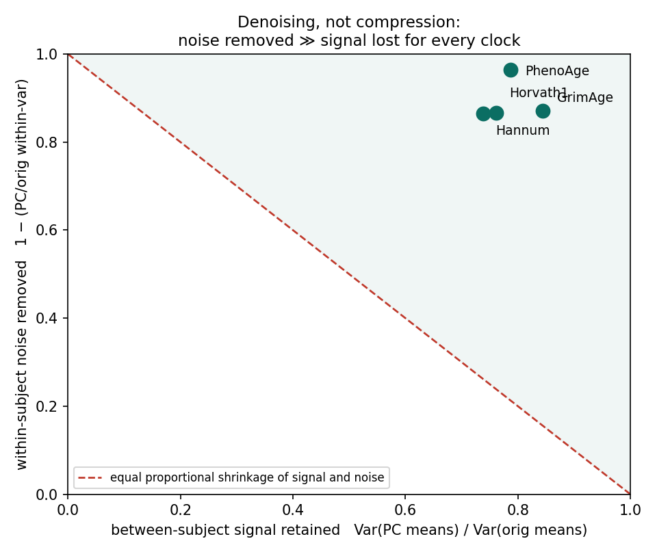
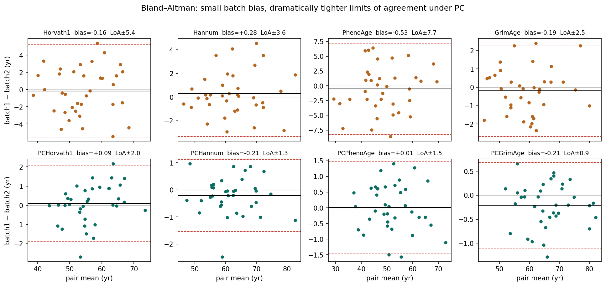
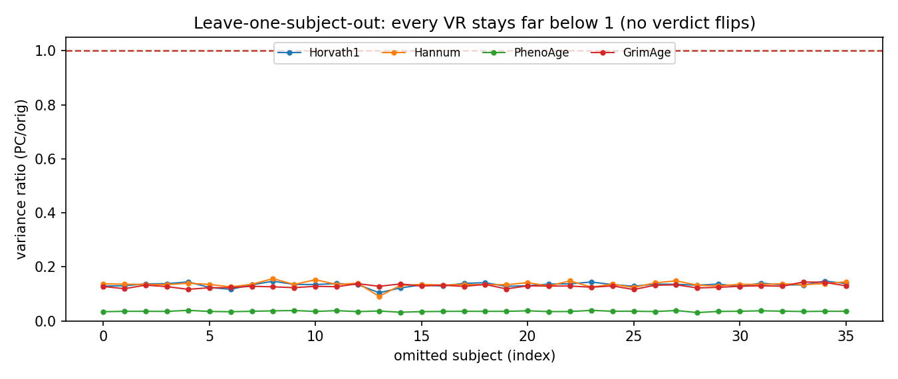

# reliage Technical Report v0.1
### Technical reliability of PC-transformed epigenetic clocks on independently reconstructed GSE55763 replicate pairs

**Status:** first real-data result, robustness-hardened. Primary claim supported *in
this dataset*; formal published-reference comparison and second-scorer sensitivity
pending. Not a v1 freeze.

> **Headline.** In 36 independently reconstructed cross-batch technical-replicate pairs
> from GSE55763, four prespecified PC-transformed epigenetic clocks exhibited 87–96%
> lower within-subject technical variance than their original counterparts. All
> paired-bootstrap confidence intervals excluded no improvement, and the conclusion was
> unchanged in every leave-one-subject-out analysis. PC clocks retained 74–85% of
> between-subject score variance and preserved chronological-age association and subject
> ranking, indicating **selective denoising with modest — not zero — compression** of
> between-person variation.

**Evidence layers.** This result rests on three distinct kinds of evidence, established
separately — a claim is only as strong as its weakest layer:

| Layer | What was established | How |
|---|---|---|
| **Software evidence** | the measurement engine is correct | ICC/variance-ratio verified against Shrout–Fleiss worked examples; 4-gate self-check |
| **Statistical evidence** | the effect survives attempted refutation | robustness: compression audit, leave-one-subject-out, Bland–Altman |
| **Scientific evidence** | the effect exists in real replicate data | independently reconstructed GSE55763 cross-batch cohort |

All three hold here; the scientific layer is bounded to one dataset, one scorer commit,
and one replicate design (see §12, §14).

---

## 1 · Central question

Do PC-transformed epigenetic clocks reduce **technical measurement error** relative to
their original versions on independently rebuilt public replicate data — and by how
much relative to each clock's own measurement-noise floor? This is a metrology
question (can a biomarker be trusted for a measurement task), not a question about
aging biology, causality, or intervention response.

## 2 · Prespecified hypothesis and primary endpoint

- **Hypothesis (H1):** for each original↔PC clock pair, the PC version has lower
  within-subject technical variance.
- **Primary endpoint:** the within-subject variance ratio VR = σ²_within(PC) /
  σ²_within(original), with a paired subject-level bootstrap 95% CI. VR < 1 favors PC;
  the pair is *supported* when the whole CI < 1.
- **Prespecified pairs (4):** Horvath1, Hannum, PhenoAge, GrimAge — original vs PC.
  GrimAge original is locked to **V1** (`CLOCK_MANIFEST.csv`), paired with PCGrimAge.
- ICC(2,1) is the primary reliability index, reported **with** absolute-error measures
  (SEM, MDC95); age-acceleration ICC is a prespecified companion.

## 3 · Dataset and replicate design

- **GSE55763** (Lehne et al. 2015), Illumina HumanMethylation450, downloaded from NCBI
  GEO (normalized betas; md5 `64654afe…`).
- The replicate design was reconstructed from the series-matrix `Sample_description`
  fields: **72 technical-replicate samples = 36 individuals × 2 batches** (group 1 /
  group 2). Every subject has exactly two measurements (0 malformed). The two
  measurements were processed in **separate batches by design** — this estimates
  reliability under cross-batch technical conditions.
- 72 replicate beta columns were extracted from the full 2,711-sample matrix
  (473,864 CpGs); 4 CpGs that were NA across all samples were dropped (→ imputed).

## 4 · Scoring implementation and provenance

- **Scorer:** methylCIPHER, pinned to commit `9e8c1e55f53c3fdeaf32a38cc8ef109be8b2a8c8`,
  R 4.6.1 (`qs2`/`stringfish` rebuilt from source). PC reference `PCClocks_data.qs2`
  (Zenodo 10.5281/zenodo.19455622).
- **Functions:** `calcHorvath1`, `calcHannum`, `calcPhenoAge`, `calcGrimAgeV1`;
  PC via `calcPCClocks`. Mean imputation (methylCIPHER PC default).
- **CpG coverage (gate):** Horvath1/Hannum/PhenoAge/PC = 100%; **GrimAge = 91%** (97
  imputed). Full provenance: `datasets/GSE55763/metadata/PROVENANCE.md`.
- Output: the Versioned Score Table `processed/scores.csv` (576 rows, per-row
  provenance). reliage consumes only this table + the replicate map — it never sees
  betas or clock formulas.

## 5 · Statistical methods

- **ICC(2,1)**, two-way random, absolute agreement, single measurement (k=2), with
  McGraw–Wong F confidence intervals and Koo–Li reliability bands.
- **Within-subject variance** = two-way ANOVA residual MSE (random within-subject
  component; excludes systematic between-batch drift). **SEM** = √MSE; **MDC95** =
  1.96·√2·SEM (per-individual smallest detectable change at 95%).
- **Variance-ratio contrast** with a subject-resampling bootstrap (2,000 iterations)
  for the 95% CI.
- **Age acceleration** = residual of score regressed on chronological age (OLS).
- Robustness: leave-one-subject-out; between/within variance decomposition; Bland–Altman
  (bias, limits of agreement, |difference|–mean correlation).
- Engines: `reliage.icc`, `reliage.benchmark`, `reliage.contrast` (verified against
  Shrout–Fleiss worked examples in `reliage.selfcheck`).

## 6 · Primary results

All four pairs are **supported** — every variance-ratio CI lies entirely below 1.

| Pair | Variance ratio (PC/orig) | 95% CI | Verdict |
|---|---|---|---|
| PhenoAge → PCPhenoAge | 0.036 | 0.021 – 0.060 | supported |
| GrimAge → PCGrimAge | 0.128 | 0.075 – 0.219 | supported |
| Horvath1 → PCHorvath1 | 0.133 | 0.065 – 0.259 | supported |
| Hannum → PCHannum | 0.135 | 0.058 – 0.329 | supported |

PC removes **87–96%** of within-subject technical variance; PhenoAge (the noisiest
original) benefits most. Joint verdict: **supported, 4/4**.



*Figure 1. Within-subject variance ratio (PC/original) with paired-bootstrap 95% CIs; null at 1.*

## 7 · Absolute measurement capability

Reliability ratios must be read with absolute error, because ICC depends on
between-subject spread. Per-individual detectable change (MDC95) tightens 2.7–5.3×:

| Clock | ICC raw → PC | SEM orig → PC (yr) | MDC95 orig → PC (yr) |
|---|---|---|---|
| PhenoAge | 0.918 → 0.996 | 2.79 → 0.53 | **7.75 → 1.46** |
| Horvath1 | 0.945 → 0.990 | 1.94 → 0.71 | 5.39 → 1.97 |
| Hannum | 0.978 → 0.996 | 1.31 → 0.48 | 3.62 → 1.33 |
| GrimAge | 0.989 → 0.998 | 0.90 → 0.32 | 2.49 → 0.89 |

Practical reading: with original PhenoAge an individual's value must change **>7.75 yr**
to exceed measurement noise; with PCPhenoAge, **1.46 yr**. Even the already-excellent
GrimAge halves its detectable-change threshold.



*Figure 2. Per-subject |replicate difference|, original → PC, by clock family.*

## 8 · Age-acceleration companion results

Age-acceleration ICC (age signal removed) is the more stringent, more decision-relevant
index. Because both replicates share a subject's age, residualization leaves SEM and the
variance ratio **unchanged**; only ICC moves.

| Clock | ICC age-accel: original → PC |
|---|---|
| PhenoAge | 0.756 → **0.988** |
| Horvath1 | 0.817 → 0.972 |
| Hannum | 0.853 → 0.986 |
| GrimAge | 0.959 → 0.988 |

Originals fall to "good" (0.76–0.96); PC clocks remain "excellent" (0.97–0.99). **The
PC advantage widens** under age acceleration — the metric studies actually use.

## 9 · Robustness analyses

Full detail: `datasets/GSE55763/out/ROBUSTNESS.md`.

**Signal preservation vs compression.** Define two metrology quantities on each pair:

- **Signal Preservation Ratio** — SPR = Var_between(PC) / Var_between(original), the
  ratio of between-subject variance of subject means. SPR ≈ 1 means between-person
  structure is retained.
- **Noise Ratio** — NR = σ²_within(PC) / σ²_within(original), i.e. the primary variance
  ratio. NR ≪ 1 means technical noise is removed.

Pure linear compression scales both variances equally, giving SPR = NR and no ICC
change. Genuine denoising is NR ≪ SPR. Observed:

| Pair | SPR | NR | interpretation |
|---|---|---|---|
| GrimAge | 0.85 | 0.13 | signal retained, noise removed |
| PhenoAge | 0.79 | 0.036 | signal retained, noise removed |
| Horvath1 | 0.76 | 0.13 | signal retained, noise removed |
| Hannum | 0.74 | 0.13 | signal retained, noise removed |

Every clock has SPR ≫ NR (noise removed 3–6× more than signal lost; Figure 3).
Chronological-age association is preserved (GrimAge improves, r 0.855→0.915) and subject
ranking is preserved (Spearman 0.87–0.96). A modest between-subject compression
(SPR 0.74–0.85, i.e. ~15–26% loss) is present but far too small to explain the gain.



*Figure 3. Between-subject signal retained vs within-subject noise removed. The dashed
line is equal proportional shrinkage of signal and noise (a null model of simple linear
compression); all clocks lie far above it.*

**Leave-one-subject-out.** All 144 leave-one-out fits keep VR far below 1 — no verdict
reversals. Hannum's wider bootstrap CI is not driven by a single subject (LOO VR stays
in 0.091–0.156).

**Pair-level outliers.** The same subjects recur among the largest replicate
discrepancies across multiple *original* clocks (indiv_05 in 3/4; indiv_09/24/35 in
2/4) and their discrepancies collapse under PC (indiv_05 PhenoAge 7.45 → 0.10 yr). This
recurrence is **consistent with shared sample/array-level technical variation** rather
than clock-specific error, though it does not by itself establish the mechanism.
`cg00017157` (flagged in a raw-matrix display) is in **none** of the five clock CpG
sets and is fully present in-cohort — no scoring or data-quality impact.

**Bland–Altman.** Batch bias is small (|bias| ≤ 0.53 yr) and removed by PC; limits of
agreement tighten 2.5–5×. **No clear evidence of magnitude-dependent absolute error was
detected** (|difference|–mean correlation non-significant for all clocks, p ≥ 0.09; a
diagnostic, not a definitive homoscedasticity test).



*Figure 4. Bland–Altman panels, original (top) vs PC (bottom): mean vs within-pair
difference, with bias and 95% limits of agreement.*



*Figure 5. Variance ratio by omitted subject; every value stays far below 1.*

## 10 · Comparison with Higgins-Chen

Against the anchors recorded in the protocol (PC raw ICC > 0.99; age-accel ICC ~0.97;
Horvath1 median abs diff ~2.1; GrimAge ~0.9):

| Dimension | Published | This study | Consistent? |
|---|---|---|---|
| Direction (PC > original, all clocks) | yes | yes | ✅ |
| Ranking (PhenoAge/Horvath1 worst originals) | yes | yes | ✅ |
| PC raw ICC | > 0.99 | 0.990–0.998 | ✅ |
| PC age-accel ICC | ~0.97 | 0.972–0.988 | ✅ |
| Mean abs diff (Horvath1 / GrimAge) | ~2.1 / ~0.9 | 2.31 / 1.01 | ✅ (mean vs median) |

**Caveat.** Exact ICC values are not expected to match across cohorts — ICC is
between-subject-spread-dependent and our 36-pair subset differs in age distribution.
The **variance ratio and MDC95** (absolute, spread-independent) are the sounder
cross-study anchors. A **formal Tier-3 tolerance comparison** on those quantities is
**not yet run**; this section is a directional consistency check only.

## 11 · Interpretation

PC transformation acts as a **selective denoiser**: it removes the large majority of
technical measurement variance while retaining most between-person signal, chronological-
age association, and subject ordering. The practical consequence is a 2.7–5.3× reduction
in per-individual detectable change (MDC95), which is what makes individual-level and
small-effect measurement feasible where the original clocks could not support it. The
mechanistic account here is **statistical** (PCA-based denoising of shared technical
variation); this study does not probe the biological content of the removed variance.

## 12 · Limitations

- **n = 36 pairs** — confidence intervals are real (Hannum's is the widest); a single
  cohort of this size cannot support tight per-clock claims.
- **Cross-batch 450K technical replicates only** — reliability under other designs
  (within-batch, EPIC, longitudinal, biological) is not addressed (Tiers B/C/D, v2).
- **GrimAge 91% coverage** (97 imputed CpGs) — lowest of the five; interpret
  GrimAge/PCGrimAge accordingly.
- **Single scorer, single commit.** pyaging (second-scorer implementation sensitivity)
  is not yet run; results may be implementation-sensitive.
- **Mechanism** is limited to selective statistical denoising; no biological claim.
- **Modest between-subject compression (~15–26%)** — the claim is retained-signal, not
  zero-loss.
- **Generalizability is unestablished** beyond GSE55763, these four clocks, this scorer
  commit, and this replicate design.

## 13 · Reproducibility instructions

Full pipeline and commands: `docs/PIR03-C2/PIPELINE.md`. In brief, from the repo root:

```bash
python datasets/GSE55763/build/parse_metadata.py GSE55763_series_matrix.txt.gz datasets/GSE55763/metadata
bash   datasets/GSE55763/build/extract_betas.sh   datasets/GSE55763/metadata/replicate_sample_ids.txt  <betas.txt.gz>  datasets/GSE55763/processed/betas.csv
Rscript reliage/scoring/score_methylCIPHER.R       datasets/GSE55763/processed/betas.csv  datasets/GSE55763/metadata/pheno.csv  datasets/GSE55763/processed/scores.csv  <PCClocks_data.qs2>
python -m reliage.scoring.run_analysis  datasets/GSE55763/processed/scores.csv datasets/GSE55763/metadata/map.csv --out datasets/GSE55763/out
python -m reliage.scoring.age_accel_icc datasets/GSE55763/processed/scores.csv datasets/GSE55763/metadata/map.csv datasets/GSE55763/metadata/pheno.csv
python -m reliage.scoring.robustness    datasets/GSE55763/processed/scores.csv datasets/GSE55763/metadata/map.csv datasets/GSE55763/metadata/pheno.csv datasets/GSE55763/out/robustness
python -m reliage.scoring.figures       datasets/GSE55763/out datasets/GSE55763/out/figures
```

## 14 · Claim record and evidence disposition

**Recorded claim (this dataset):** PC-transformed clocks reduce within-subject technical
variance by 87–96% versus their originals across four prespecified pairs in GSE55763
cross-batch replicates; all bootstrap CIs exclude the null; robust to leave-one-subject-
out; between-person signal, age association, and ranking retained (selective denoising,
modest compression).

| Dimension | Disposition |
|---|---|
| Primary claim | **Supported in this dataset** |
| Robustness | **Strong** (compression audit, LOSO, outliers, Bland–Altman) |
| Mechanistic interpretation | Limited to selective statistical denoising |
| Published replication | Directionally consistent; **formal reference comparison pending** |
| Generalizability | **Unestablished** beyond GSE55763 / these 4 clocks / this commit / cross-batch 450K |
| v1 freeze | **Hold** until pyaging sensitivity + formal reference comparison + independent rerun |

**Next steps (clearly separate analyses):** (1) pyaging implementation-sensitivity check
on overlapping clocks; (2) formal Tier-3 tolerance comparison to published figures;
(3) independent third-party rerun. Only then consider tagging **reliage v1.0** and
freezing the protocol.

## 15 · Remaining uncertainties

Explicitly, what this result does **not** yet establish:

| Question | Status |
|---|---|
| Does another scoring implementation (pyaging) reproduce this? | Pending (Experiment E2) |
| Does another dataset reproduce this? | Pending |
| Does EPIC (vs 450K) behave similarly? | Unknown |
| Does biological (not just technical) reliability improve similarly? | Unknown (out of v1 scope) |
| Is the effect general across clock families beyond these four? | Unknown |
| Does the formal Tier-3 tolerance comparison to published figures pass? | Not yet run |

The claim in §14 is scoped to GSE55763, these four clocks, this scorer commit, and
cross-batch 450K technical replicates. Nothing here should be read as extending beyond
those bounds.
